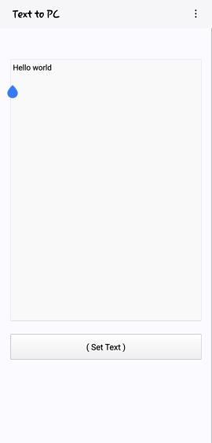

# Text-To-PC

This is a project to send a text of Phone to the **PC** manually .

In this way, we write the text in the program and press the **( Set Sext )** button, and the text is saved in the **To PC** file, and then we transfer this file to the PC in any way, such as cable or network .

---

1. Save text easily and quickly
2. Open a file in app
3. Save as button

---
 

